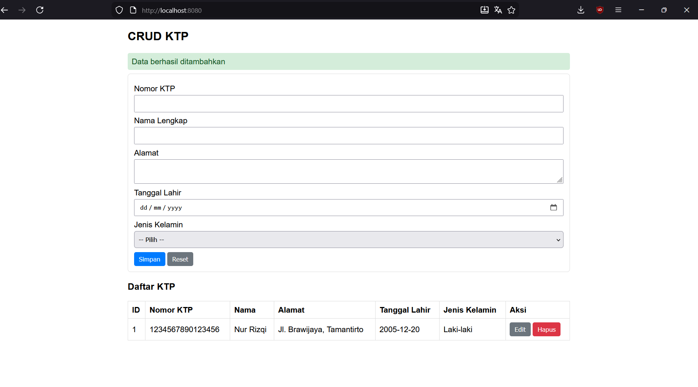

# Tugas_CRUD_20240140056
Aplikasi CRUD KTP menggunakan Spring Boot + MySQL (server) dan HTML/CSS/JS + jQuery (client).

## Ringkasan
- Backend: Spring Boot + Spring Data JPA
- Database: MySQL (schema `spring`)
- Frontend: static file `index.html` di `src/main/resources/static`

## Struktur package
- com.rizqi.crud.entity
- com.rizqi.crud.dto
- com.rizqi.crud.repository
- com.rizqi.crud.service
- com.rizqi.crud.service.impl
- com.rizqi.crud.mapper
- com.rizqi.crud.controller
- com.rizqi.crud.exception

## Tabel `ktp`
Kolom:
- id INT PRIMARY KEY AUTO_INCREMENT
- nomor_ktp VARCHAR UNIQUE
- nama_lengkap VARCHAR
- alamat VARCHAR
- tanggal_lahir DATE
- jenis_kelamin VARCHAR

## Menjalankan aplikasi
1. Pastikan MySQL berjalan dan database `spring` tersedia (lihat skrip SQL di repository).
2. Ubah `application.properties` sesuai konfigurasi DB (username/password).
3. Build & run:
   ```bash
   mvn clean package
   mvn spring-boot:run
